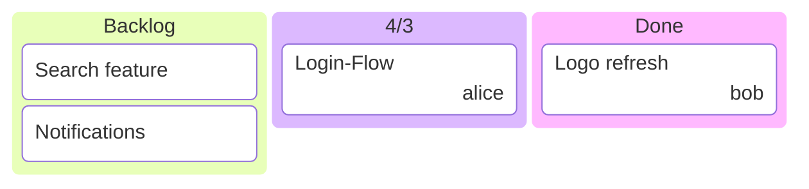

<!-- AUTO-GENERATED from specification/public/en/app-kanban.md — do not edit here. -->

---
# Vance Application — `app: kanban`

> Self-contained Kanban-board pattern built on the `kind: application` foundation (see `doc-kind-application.md`). One folder = one board. Sub-folders = columns. One `kind: card` file per ticket. Derived artifacts (`_board.md`, `_stats.yaml`) regenerate from the source cards.

## 1. Why a Kanban application

After Calendar proved out the `kind: application` foundation (folder-as-app, manifest-driven, deterministic Java-driven create/refresh), Kanban is the second concrete app — same pattern, different domain. It exists because:

- Workflow-state tracking is fundamentally different from time-anchored planning (the Calendar app). Cards move between columns; events sit on a timeline.
- Boards are a high-leverage primitive in Vance because most "what should I do?" sessions resolve into "promote X from todo to doing, decompose Y in backlog into smaller cards". A board representation is closer to that vocabulary than a calendar or a checklist.
- Cards are description-heavy: a Kanban card has acceptance criteria, design notes, links, discussion. That argues for one **file** per card (Markdown body + structural front-matter), not one Map entry inside a single big YAML.

## 2. Folder layout

```
boards/sprint-q3/                  ← suite folder
├── _app.yaml                      ← manifest (kind: application, app: kanban)
├── _board.md                      ← auto-generated (kind: diagram, Mermaid)
├── _stats.yaml                    ← auto-generated (kind: data)
├── backlog/                       ← column = sub-folder
│   ├── search-feature.md
│   └── notifications.md
├── todo/
├── doing/
│   └── login-flow.md
├── review/
└── done/
    └── logo-refresh.md
```

**Column resolution rule:** the **leaf folder** of a card's path *relative to the suite root* is its column. Files directly in the root land in `backlog`. Deeply nested (`a/b/c/card.md`) → column = `c`. This mirrors the Calendar rule (Calendar uses `default` as the fallback; Kanban uses `backlog` because that's the most natural "where does a new card with no explicit column go" answer).

**Underscore prefix is system-managed:** `_app.yaml`, `_board.md`, `_stats.yaml`. `KanbanFolderReader` excludes these from the card list so a rebuild stays idempotent.

## 3. Card schema (`kind: card`)

Markdown is the primary mime type — cards have prose bodies. YAML and JSON are also supported (for tooling).

```markdown
---
kind: card
title: Login-Flow implementieren
priority: high
assignee: alice
labels: auth, sprint-q3
dueDate: 2026-07-15
estimate: 5
blocked: false
---

Email + Passwort, JWT-basiert.

## Akzeptanzkriterien
- [x] Registrierung
- [ ] Login
- [ ] Logout
- [ ] Password-Reset
```

| Field | Type | Notes |
|---|---|---|
| `title` | string | Headline; falls back to filename stem when missing. |
| `priority` | string | Free-form. `critical` / `high` render as standouts on the board. |
| `assignee` | string | User identifier (login / email / name). |
| `labels` | string list | Free tags. The manifest's `blockedLabel` (default `blocked`) flags the card. |
| `dueDate` | string | ISO date (`yyyy-MM-dd`). Pass-through. |
| `estimate` | number | Story points / hours. Renderer doesn't pretend to know the unit. |
| `blocked` | boolean | True flags the card; equivalent to having the `blocked` label. |
| Markdown body | string | Free description. GFM checkboxes (`- [ ]` / `- [x]`) feed the `progress.subtasks` stat. |

**Cross-format round-trip:** Markdown front-matter is flat strings, so list-valued fields (`labels`) are comma-separated on disk. JSON/YAML store them as native arrays. Converting between mime types is lossy by design — commas inside label names get split.

## 4. Manifest schema

```yaml
$meta:
  kind: application
  app: kanban
title: "Sprint Q3 Board"
description: "Auth + Search"

kanban:
  columns:                          # Map keyed by column-name, NOT an array.
    backlog: { title: "Backlog",     order: 1 }
    todo:    { title: "To Do",       order: 2, wipLimit: 5 }
    doing:   { title: "In Progress", order: 3, wipLimit: 3 }
    review:  { title: "Review",      order: 4, wipLimit: 2 }
    done:    { title: "Done",        order: 5 }

  board:
    outputPath: "_board.md"
    style: "mermaid"                # mermaid (default) | table
    maxCardsPerColumn: 20           # truncate beyond this with a "+N more" marker
    columnOrder: []                 # optional explicit order; else `order:` per column

  stats:
    outputPath: "_stats.yaml"
    blockedLabel: "blocked"
    staleThresholdDays: 14          # 0 = disable stale-detection

  wipEnforce: "soft"                # soft (default — warns) | hard (blocks moves)
```

Columns referenced by cards but missing from `kanban.columns` are auto-added during refresh with `order` after the declared ones (so an LLM that dispatches a card into a column it forgot to declare doesn't silently lose the card).

## 5. Derived artifacts

### 5.1 `_board.md`

Two output styles via `board.style`:

**Mermaid (default).** Native `kanban` diagram (Mermaid 11.3+). Wrapped in a `kind: diagram` Markdown body with the `mermaid` fence so the standard diagram viewer renders it.



WIP-exceeded columns get a `(count/limit)` suffix. Overflow (more than `maxCardsPerColumn`) becomes a `+N more` placeholder node.

**Table.** Markdown table with one column per board column, one card per row, inside a `kind: text` body. Better for hard-copy / long card titles where Mermaid wraps badly.

Card ordering inside each column: priority desc → dueDate asc → title asc.

### 5.2 `_stats.yaml`

`kind: data` body with deterministic structure:

```yaml
$meta:
  kind: data
folder: projects/website/board
columns:
  backlog:  { count: 4 }
  todo:     { count: 2, wipLimit: 5 }
  doing:    { count: 4, wipLimit: 3, wipExceeded: true }
  review:   { count: 1, wipLimit: 2 }
  done:     { count: 5 }
blocked:
  - projects/website/board/doing/db-migration.md
stale:
  - projects/website/board/backlog/old-idea.md
progress:
  totalCards: 16
  done: 5
  open: 11
  ratio: 0.31
  subtasks: { total: 22, done: 14, ratio: 0.64 }
```

- `done` counts cards in any column whose name matches `done` / `completed` / `closed` / `erledigt` (case-insensitive). The board owner doesn't have to special-case "done".
- `stale` uses the document's `createdAt` as a proxy because `DocumentDocument` doesn't track per-update timestamps yet. **Known limitation** — over-counts cards that were touched in place. Improving this needs a `modifiedAt` on `DocumentDocument`.
- `subtasks` only appears when at least one card has GFM checkboxes in its body.

## 6. Tools

| Tool | Purpose | Where the logic lives |
|---|---|---|
| `kanban_app_create` | One-shot bootstrap: manifest + cards + auto-rebuild. The recommended entry point. | `KanbanApplication.create(...)` via `VanceApplication` contract. |
| `kanban_card_create` | Single-card add. Doesn't auto-rebuild. | `KanbanCardCreateTool` direct write through `DocumentService`. |
| `kanban_move` | Move a card between columns. Respects WIP limits (soft warns, hard blocks). Optional `rebuild: true`. | `KanbanMoveTool` via `DocumentService.update(..., newPath=...)`. |
| `kanban_aggregate` | Read-only query — column / assignee / labels / blocked / priority filters. | `KanbanAggregateTool` via `KanbanFolderReader.scan`. |
| `app_rebuild` | Generic — works for any Vance application. Dispatches to `KanbanApplication.refresh()` via the registry. | `AppRebuildTool` + `VanceApplicationRegistry`. |

The Java services own the schema. The LLM doesn't get to invent it.

## 7. WIP-limit enforcement

`wipEnforce` controls `kanban_move`:

- **soft** (default) — over-limit moves succeed. The result carries `warnings: ["wip-exceeded:<column>:<count>/<limit>"]`. The LLM should surface that warning in the chat reply.
- **hard** — over-limit moves are rejected with a `ToolException`. Recovery: move another card out of the target column first.

`_stats.yaml` always carries the `wipExceeded` flag per column regardless of enforcement mode — it's pure observation, not gating.

## 8. Relationship to other apps

| Use case | Use this | Why |
|---|---|---|
| Workflow states (backlog → done) | `app: kanban` | Cards move between columns. |
| Time-anchored plan with milestones / dependencies in time | `app: calendar` | Events sit on a timeline; lanes are organizational, not states. |
| Free-form todo with no workflow | `kind: checklist` | Kanban manifests are overhead. |
| Project management with resource allocation, burndown | Out of scope | Export to Linear / Jira / GitHub Projects. |

A folder cannot be both `app: calendar` and `app: kanban`. Each app folder hosts exactly one `_app.yaml`. The forward-compatibility design of `ApplicationDocument` (nested `config.<app>` blocks) supports an eventual "multi-face folder" but no concrete app uses that today.

## 9. Web-UI editor

Kanban gets a dedicated interactive editor in the web UI, hosted by the **generic App-Editor MPA-entry** (`app.html`). Pattern: one HTML entry, the `AppEditor.vue` dispatcher reads `$meta.app` from the manifest and lazy-loads the right sub-component (`KanbanBoard.vue` for kanban, future `CalendarPlanner.vue` for calendar, etc.). Same architecture as serverside: one entry point, registry-style dispatch.

**Routing:** clicking an `_app.yaml` file in the Documents editor redirects to `/app.html?documentId={id}` instead of opening the generic document viewer (`DocumentApp.vue` checks `kind === 'application' && path.endsWith('/_app.yaml')`).

**Board view (`KanbanBoard.vue`):**
- Horizontal scroll, one column per `KanbanColumnView`. Card sort = priority desc → dueDate asc → title asc.
- Drag-and-drop via `vue-draggable-plus`. Cross-column drop emits an optimistic local mutation, then `POST /kanban/move`; on error the local move rolls back.
- WIP-limit display in the column header (`count/limit`, red when exceeded). Soft-overflow warnings from the move response surface as a `VAlert` banner.
- Per-column "+" button opens a new-card modal.
- Card click opens the right-panel `KanbanCardDetail.vue`.

**Card detail (`KanbanCardDetail.vue`):**
- Edit all fields (title, priority, assignee, labels, dueDate, estimate, blocked, body).
- Markdown body uses the shared `CodeEditor` with `text/markdown` syntax highlighting. GFM checkboxes in the body feed the board's subtask progress badge.
- Dirty-state tracking; Save / Discard / Delete actions.

**REST surface — `KanbanBoardController`:**

| Endpoint | Purpose |
|---|---|
| `GET  /brain/{tenant}/kanban/board?projectId&folder` | Full board view (`KanbanBoardView`). |
| `POST /brain/{tenant}/kanban/move?projectId&folder` | Move a card. Body `{ card, toColumn }`. WIP-soft → warnings; WIP-hard → 400-style error. |
| `POST /brain/{tenant}/kanban/cards?projectId&folder` | Create a card. Body = `KanbanCardCreateRequest`. |
| `PATCH /brain/{tenant}/kanban/cards?projectId&folder&path` | Patch fields (any subset). |
| `DELETE /brain/{tenant}/kanban/cards?projectId&folder&path` | Soft-delete (trash). |
| `POST /brain/{tenant}/kanban/rebuild?projectId&folder` | Regenerate `_board.md` + `_stats.yaml`. |

The controller is a **thin adapter** over `KanbanApplication.moveCard()` + `KanbanFolderReader.scan()` + `DocumentService` — no business logic. The move logic is shared between the REST controller and the `kanban_move` tool by a public `KanbanApplication.moveCard(...)` method.

**What the UI does NOT do (v1):**
- **No live updates.** Two browsers viewing the same board don't see each other's moves until one refreshes. Live-update WebSocket events are deferred — same v1 stance as the rest of the editors (see `web-ui.md` §3).
- **No inline body editing on the card tile.** Click into the right panel to edit the body. Inline edit was tempting but adds rich-text-editor weight (CodeMirror or Tiptap) to every visible card.
- **No swimlanes / row grouping.** Columns only.
- **No card-ID stability.** Filename is the de-facto id. Renaming a card breaks any external references.

## 10. Non-goals (v1)

- **No real-time multi-user board.** Two LLM turns moving the same card race on optimistic locking; the loser retries. Acceptable for v1 — the average user is solo.
- **No card history / audit log.** `DocumentArchiveDocument` captures versions of the card body if the document-archive feature is enabled, but there's no "card X moved from todo to doing at 14:32" timeline.
- **No mermaid-kanban interactivity in the static `_board.md`.** The Mermaid block is a fallback for chat embeds / non-app-aware viewers. The interactive web-UI board is the canonical view.

## 11. Open questions / future work

1. **Card-ID stability.** v1 uses the filename as the implicit ID. Renaming breaks references. A `$meta.id` (e.g. `KAN-42`) would help cross-card linking and make external integrations easier. Decision deferred — wait for a concrete need (`kanban_aggregate` filter by ID, sibling-card references).
2. **`modifiedAt` on DocumentDocument.** Required for accurate stale-detection. Currently approximated with `createdAt`.
3. **Subtask promotion.** A card's GFM checkboxes could be promoted to sibling cards via `kanban_subtask_promote(card, subtask)`. Useful when a checklist item grows into its own workstream. Not in v1.
4. **Linked cards (depends-on / blocks).** Out of scope for v1. Cross-card relationships likely become a `kind: graph` overlay rather than card-internal references.
5. **Multi-face folders.** `config.kanban` + `config.calendar` coexisting in one `_app.yaml` would let a folder be both a board and a timeline of the same items. Possible because of the nested-config design but no concrete user yet.
